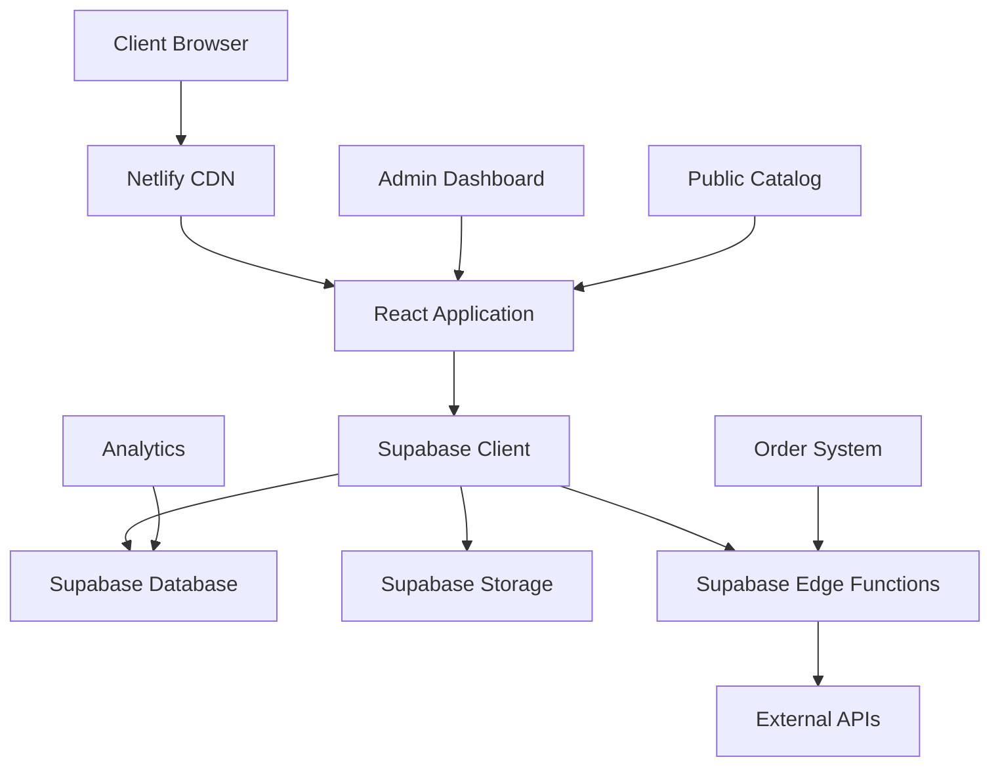

# 🚀 PLAN DE DESARROLLO ACTUALIZADO - Tu Tiendita Digital

**Versión:** 2.0  
**Fecha de Actualización:** 14 de Junio, 2025  
**Estado Actual:** 🟡 Funcional con Problemas Críticos  

---

## 📋 RESUMEN EJECUTIVO ACTUALIZADO

**Tu Tiendita Digital** ha demostrado ser una plataforma sólida con arquitectura bien pensada, pero requiere correcciones críticas inmediatas. El análisis técnico revela que con las reparaciones adecuadas, el proyecto tiene alto potencial competitivo.

### 🎯 OBJETIVO ACTUALIZADO

Corregir errores críticos identificados y transformar el proyecto en una plataforma production-ready para emprendedores latinoamericanos, manteniendo la visión original de democratizar el comercio digital.

---

## 🚨 PROBLEMAS CRÍTICOS IDENTIFICADOS

### 1. **ERROR CRÍTICO - PublicCatalog.tsx**
**Severidad:** 🔴 BLOQUEANTE  
**Ubicación:** `src/components/PublicCatalog/PublicCatalog.tsx`

#### Síntomas:
- Aplicación no compila
- Catálogo público no funciona
- Bundle roto

#### Causas Raíz:
```typescript
// LÍNEA 1-7: Imports duplicados
import React, { useState, useEffect, useCallback, useMemo, useRef } from 'react'; 
// ... resto de imports duplicados

// LÍNEA 328: Template literal malformado
return $${finalPrice.toLocaleString()}; // ❌ Falta backtick

// LÍNEAS 349-361: JSX sin return
Cargando catálogo... // ❌ JSX no envuelto
```

#### Plan de Corrección:
```typescript
// 1. Eliminar línea 7 (imports duplicados)
// 2. Corregir línea 328:
return `$${finalPrice.toLocaleString()}`;

// 3. Envolver JSX en return statements
return (
  <div className="flex items-center justify-center min-h-screen">
    <div className="text-center">
      <div className="animate-spin rounded-full h-12 w-12 border-b-2 border-blue-600 mx-auto mb-4"></div>
      <h2 className="text-xl font-semibold text-gray-900 mb-2">Cargando catálogo...</h2>
      <p className="text-gray-600">Esto puede tomar unos segundos</p>
    </div>
  </div>
);
```

### 2. **Testing Infrastructure - 0% Coverage**
**Severidad:** 🟡 ALTA PRIORIDAD

#### Estado Actual:
- Sin framework de testing configurado
- 0% cobertura de código
- Sin CI/CD pipeline

#### Plan de Implementación:
```bash
# Fase 1: Setup básico
npm install -D vitest @testing-library/react @testing-library/jest-dom

# Fase 2: Tests críticos
- AuthContext.test.tsx
- useProductSelection.test.ts  
- PublicCatalog.test.tsx (post-corrección)

# Fase 3: Integration tests
- Login flow
- Product CRUD
- WhatsApp integration
```

#### Bolt.new Integration
```typescript
// Add Bolt.new badge component
const BoltBadge: React.FC = () => (
  <div className="fixed bottom-4 right-4 z-50">
    <a 
      href="https://bolt.new" 
      target="_blank" 
      rel="noopener noreferrer"
      className="inline-flex items-center space-x-2 bg-gradient-to-r from-purple-600 to-blue-600 text-white px-4 py-2 rounded-full shadow-lg hover:shadow-xl transition-all duration-300 transform hover:scale-105"
    >
      <Zap className="h-4 w-4" />
      <span className="text-sm font-medium">Built with Bolt.new</span>
    </a>
  </div>
);
```

#### Custom Domain Configuration
- **Primary Domain**: `tutiendita.digital`
- **Staging Domain**: `staging.tutiendita.digital`
- **API Domain**: `api.tutiendita.digital`

#### Enhanced Database Schema
```sql
-- Performance optimization indexes (already implemented)
-- Additional tables for e-commerce features

-- Orders table
CREATE TABLE orders (
  id uuid PRIMARY KEY DEFAULT gen_random_uuid(),
  user_id uuid REFERENCES users(id),
  customer_name text NOT NULL,
  customer_email text NOT NULL,
  customer_phone text NOT NULL,
  customer_address text NOT NULL,
  total_amount decimal(10,2) NOT NULL,
  status text DEFAULT 'pending' CHECK (status IN ('pending', 'confirmed', 'processing', 'shipped', 'delivered', 'cancelled')),
  payment_method text,
  payment_status text DEFAULT 'pending' CHECK (payment_status IN ('pending', 'paid', 'failed', 'refunded')),
  notes text,
  created_at timestamptz DEFAULT now(),
  updated_at timestamptz DEFAULT now()
);

-- Order items table
CREATE TABLE order_items (
  id uuid PRIMARY KEY DEFAULT gen_random_uuid(),
  order_id uuid REFERENCES orders(id) ON DELETE CASCADE,
  product_id uuid REFERENCES products(id),
  variant_id uuid REFERENCES product_variants(id),
  quantity integer NOT NULL,
  unit_price decimal(10,2) NOT NULL,
  total_price decimal(10,2) NOT NULL,
  created_at timestamptz DEFAULT now()
);

-- Customer reviews table
CREATE TABLE product_reviews (
  id uuid PRIMARY KEY DEFAULT gen_random_uuid(),
  product_id uuid REFERENCES products(id) ON DELETE CASCADE,
  customer_name text NOT NULL,
  customer_email text NOT NULL,
  rating integer CHECK (rating >= 1 AND rating <= 5),
  comment text,
  is_verified boolean DEFAULT false,
  is_approved boolean DEFAULT false,
  created_at timestamptz DEFAULT now()
);

-- Analytics table
CREATE TABLE analytics_events (
  id uuid PRIMARY KEY DEFAULT gen_random_uuid(),
  store_slug text NOT NULL,
  event_type text NOT NULL,
  product_id uuid,
  session_id text,
  user_agent text,
  ip_address inet,
  metadata jsonb,
  created_at timestamptz DEFAULT now()
);
```

#### Real-time Features
```typescript
// Enhanced real-time inventory management
const useRealTimeInventory = (productId: string) => {
  const [stock, setStock] = useState<number>(0);
  
  useEffect(() => {
    const channel = supabase
      .channel(`inventory-${productId}`)
      .on('postgres_changes', {
        event: 'UPDATE',
        schema: 'public',
        table: 'products',
        filter: `id=eq.${productId}`
      }, (payload) => {
        setStock(payload.new.stock_quantity);
      })
      .subscribe();

    return () => supabase.removeChannel(channel);
  }, [productId]);

  return stock;
};

// Real-time order notifications
const useOrderNotifications = (storeSlug: string) => {
  const [newOrders, setNewOrders] = useState<Order[]>([]);
  
  useEffect(() => {
    const channel = supabase
      .channel(`orders-${storeSlug}`)
      .on('postgres_changes', {
        event: 'INSERT',
        schema: 'public',
        table: 'orders'
      }, (payload) => {
        setNewOrders(prev => [payload.new as Order, ...prev]);
      })
      .subscribe();

    return () => supabase.removeChannel(channel);
  }, [storeSlug]);

  return newOrders;
};
```

### 2. Advanced Product Management System

#### Enhanced Product Interface
```typescript
interface EnhancedProduct extends Product {
  seoTitle?: string;
  seoDescription?: string;
  tags: string[];
  weight?: number;
  dimensions?: {
    length: number;
    width: number;
    height: number;
  };
  shippingClass?: string;
  digitalProduct: boolean;
  downloadUrl?: string;
  reviews: ProductReview[];
  averageRating: number;
  totalReviews: number;
  viewCount: number;
  salesCount: number;
}
```

#### Smart Inventory Management
```typescript
// Automated stock calculation with reservations
const calculateAvailableStock = (product: EnhancedProduct): number => {
  const baseStock = product.stockQuantity;
  const variantStock = product.variants?.reduce((sum, variant) => 
    sum + (variant.isAvailable ? variant.stockQuantity : 0), 0
  ) || 0;
  
  // Consider reserved stock from pending orders
  const reservedStock = product.reservedQuantity || 0;
  
  return Math.max(0, baseStock + variantStock - reservedStock);
};

// Auto-reorder system
const checkReorderPoint = async (product: EnhancedProduct) => {
  const availableStock = calculateAvailableStock(product);
  const reorderPoint = product.reorderPoint || 5;
  
  if (availableStock <= reorderPoint) {
    await triggerReorderNotification(product);
  }
};

// Stock reservation system
const reserveStock = async (productId: string, variantId: string | null, quantity: number) => {
  const { data, error } = await supabase.rpc('reserve_product_stock', {
    p_product_id: productId,
    p_variant_id: variantId,
    p_quantity: quantity
  });
  
  if (error) throw error;
  return data;
};
```

#### Advanced Search and Filtering
```typescript
// Enhanced search with full-text search
const searchProducts = async (params: {
  query?: string;
  category?: string;
  priceMin?: number;
  priceMax?: number;
  rating?: number;
  inStock?: boolean;
  tags?: string[];
  sortBy?: 'relevance' | 'price' | 'rating' | 'newest';
  page: number;
  limit: number;
}) => {
  let query = supabase
    .from('products')
    .select(`
      *,
      product_images(*),
      product_variants(*),
      product_reviews(rating)
    `, { count: 'exact' })
    .eq('is_available', true);

  // Full-text search
  if (params.query) {
    query = query.textSearch('search_vector', params.query);
  }

  // Apply filters
  if (params.category) query = query.eq('category', params.category);
  if (params.priceMin) query = query.gte('base_price', params.priceMin);
  if (params.priceMax) query = query.lte('base_price', params.priceMax);
  if (params.inStock) query = query.gt('stock_quantity', 0);

  // Apply sorting
  switch (params.sortBy) {
    case 'price':
      query = query.order('base_price', { ascending: true });
      break;
    case 'rating':
      query = query.order('average_rating', { ascending: false });
      break;
    case 'newest':
      query = query.order('created_at', { ascending: false });
      break;
    default:
      // Relevance sorting for text search
      break;
  }

  // Pagination
  const from = (params.page - 1) * params.limit;
  const to = from + params.limit - 1;
  query = query.range(from, to);

  return query;
};
```

### 3. Performance Optimizations

#### Edge Functions for Critical Operations
```typescript
// Supabase Edge Function for order processing
// File: supabase/functions/process-order/index.ts
import { serve } from "https://deno.land/std@0.168.0/http/server.ts"
import { createClient } from 'https://esm.sh/@supabase/supabase-js@2'

interface OrderRequest {
  storeSlug: string;
  items: Array<{
    productId: string;
    variantId?: string;
    quantity: number;
  }>;
  customer: {
    name: string;
    email: string;
    phone: string;
    address: string;
  };
  notes?: string;
}

serve(async (req) => {
  try {
    const orderData: OrderRequest = await req.json();
    
    const supabase = createClient(
      Deno.env.get('SUPABASE_URL') ?? '',
      Deno.env.get('SUPABASE_SERVICE_ROLE_KEY') ?? ''
    );

    // Validate inventory and calculate total
    let totalAmount = 0;
    const orderItems = [];

    for (const item of orderData.items) {
      const { data: product } = await supabase
        .from('products')
        .select('*, product_variants(*)')
        .eq('id', item.productId)
        .single();

      if (!product) {
        throw new Error(`Product ${item.productId} not found`);
      }

      let unitPrice = product.base_price;
      let availableStock = product.stock_quantity;

      if (item.variantId) {
        const variant = product.product_variants.find(v => v.id === item.variantId);
        if (!variant) {
          throw new Error(`Variant ${item.variantId} not found`);
        }
        unitPrice += variant.price_modifier;
        availableStock = variant.stock_quantity;
      }

      if (availableStock < item.quantity) {
        throw new Error(`Insufficient stock for ${product.name}`);
      }

      const itemTotal = unitPrice * item.quantity;
      totalAmount += itemTotal;

      orderItems.push({
        product_id: item.productId,
        variant_id: item.variantId,
        quantity: item.quantity,
        unit_price: unitPrice,
        total_price: itemTotal
      });
    }

    // Create order
    const { data: order, error: orderError } = await supabase
      .from('orders')
      .insert({
        customer_name: orderData.customer.name,
        customer_email: orderData.customer.email,
        customer_phone: orderData.customer.phone,
        customer_address: orderData.customer.address,
        total_amount: totalAmount,
        notes: orderData.notes,
        status: 'pending'
      })
      .select()
      .single();

    if (orderError) throw orderError;

    // Create order items
    const orderItemsWithOrderId = orderItems.map(item => ({
      ...item,
      order_id: order.id
    }));

    const { error: itemsError } = await supabase
      .from('order_items')
      .insert(orderItemsWithOrderId);

    if (itemsError) throw itemsError;

    // Reserve stock
    for (const item of orderData.items) {
      await supabase.rpc('reserve_product_stock', {
        p_product_id: item.productId,
        p_variant_id: item.variantId,
        p_quantity: item.quantity
      });
    }

    // Send WhatsApp notification to store owner
    const { data: storeOwner } = await supabase
      .from('users')
      .select('whatsapp_number, store_name')
      .eq('store_slug', orderData.storeSlug)
      .single();

    if (storeOwner?.whatsapp_number) {
      await sendWhatsAppNotification(storeOwner, order, orderItems);
    }

    return new Response(JSON.stringify({ 
      success: true, 
      orderId: order.id,
      totalAmount 
    }), {
      headers: { 'Content-Type': 'application/json' }
    });

  } catch (error) {
    return new Response(JSON.stringify({ 
      success: false, 
      error: error.message 
    }), {
      status: 400,
      headers: { 'Content-Type': 'application/json' }
    });
  }
});
```

#### Caching Strategies
```typescript
// React Query for client-side caching
import { useQuery, useMutation, useQueryClient } from '@tanstack/react-query';

// Product catalog caching
export const useProductCatalog = (storeSlug: string, filters: ProductFilters) => {
  return useQuery({
    queryKey: ['catalog', storeSlug, filters],
    queryFn: () => fetchPublicCatalogData(storeSlug, filters),
    staleTime: 5 * 60 * 1000, // 5 minutes
    cacheTime: 10 * 60 * 1000, // 10 minutes
  });
};

// Product details caching
export const useProduct = (productId: string) => {
  return useQuery({
    queryKey: ['product', productId],
    queryFn: () => fetchProductWithImages(productId),
    staleTime: 2 * 60 * 1000, // 2 minutes
  });
};

// Optimistic updates for inventory
export const useUpdateStock = () => {
  const queryClient = useQueryClient();
  
  return useMutation({
    mutationFn: updateProductStock,
    onMutate: async (variables) => {
      // Cancel outgoing refetches
      await queryClient.cancelQueries(['product', variables.productId]);
      
      // Snapshot previous value
      const previousProduct = queryClient.getQueryData(['product', variables.productId]);
      
      // Optimistically update
      queryClient.setQueryData(['product', variables.productId], (old: any) => ({
        ...old,
        stockQuantity: variables.newStock
      }));
      
      return { previousProduct };
    },
    onError: (err, variables, context) => {
      // Rollback on error
      queryClient.setQueryData(['product', variables.productId], context?.previousProduct);
    },
    onSettled: (data, error, variables) => {
      // Refetch after mutation
      queryClient.invalidateQueries(['product', variables.productId]);
    },
  });
};
```

#### Image Optimization
```typescript
// Enhanced image processing with WebP support
const processImage = async (file: File): Promise<ProcessedImage> => {
  const canvas = document.createElement('canvas');
  const ctx = canvas.getContext('2d');
  const img = new Image();

  return new Promise((resolve, reject) => {
    img.onload = () => {
      // Calculate optimal dimensions
      const { width, height } = calculateOptimalDimensions(img.width, img.height);
      
      canvas.width = width;
      canvas.height = height;
      
      // Draw and compress
      ctx?.drawImage(img, 0, 0, width, height);
      
      // Generate multiple formats
      const formats = ['image/webp', 'image/jpeg'];
      const results: ProcessedImage = { variants: [] };
      
      let completed = 0;
      
      formats.forEach(format => {
        canvas.toBlob((blob) => {
          if (blob) {
            results.variants.push({
              format,
              blob,
              size: blob.size
            });
          }
          
          completed++;
          if (completed === formats.length) {
            // Choose best format (smallest size with good quality)
            const bestVariant = results.variants.reduce((best, current) => 
              current.size < best.size ? current : best
            );
            
            resolve({
              ...results,
              optimized: bestVariant
            });
          }
        }, format, 0.85);
      });
    };
    
    img.onerror = reject;
    img.src = URL.createObjectURL(file);
  });
};
```

### 4. Security Implementation

#### Enhanced Authentication
```typescript
// Multi-factor authentication support
const enableMFA = async (userId: string) => {
  const { data, error } = await supabase.auth.mfa.enroll({
    factorType: 'totp',
    friendlyName: 'Tu Tiendita Digital'
  });
  
  if (error) throw error;
  return data;
};

// Session management
const useSecureSession = () => {
  const [sessionValid, setSessionValid] = useState(true);
  
  useEffect(() => {
    const checkSession = async () => {
      const { data: { session }, error } = await supabase.auth.getSession();
      
      if (error || !session) {
        setSessionValid(false);
        return;
      }
      
      // Check if session is close to expiry
      const expiresAt = session.expires_at;
      const now = Math.floor(Date.now() / 1000);
      
      if (expiresAt && (expiresAt - now) < 300) { // 5 minutes
        // Refresh session
        const { error: refreshError } = await supabase.auth.refreshSession();
        if (refreshError) {
          setSessionValid(false);
        }
      }
    };
    
    checkSession();
    const interval = setInterval(checkSession, 60000); // Check every minute
    
    return () => clearInterval(interval);
  }, []);
  
  return sessionValid;
};
```

#### Content Security Policy
```typescript
// CSP headers for Netlify
const securityHeaders = {
  'Content-Security-Policy': `
    default-src 'self';
    script-src 'self' 'unsafe-inline' 'unsafe-eval' https://cdn.jsdelivr.net;
    style-src 'self' 'unsafe-inline' https://fonts.googleapis.com;
    img-src 'self' data: https: blob:;
    font-src 'self' https://fonts.gstatic.com;
    connect-src 'self' https://*.supabase.co wss://*.supabase.co;
    frame-src 'none';
    object-src 'none';
    base-uri 'self';
    form-action 'self';
  `.replace(/\s+/g, ' ').trim(),
  'X-Frame-Options': 'DENY',
  'X-Content-Type-Options': 'nosniff',
  'Referrer-Policy': 'strict-origin-when-cross-origin',
  'Permissions-Policy': 'camera=(), microphone=(), geolocation=()'
};
```

---

## 🧪 METODOLOGÍA DE TESTING

### ⚠️ PRINCIPIOS DE DESARROLLO ESTRICTOS
- **Entorno Único:** `http://localhost:5173`
- **Perspectiva del Usuario:** Todas las pruebas desde la vista del usuario final
- **Internet:** Solo para casos muy urgentes
- **Modificaciones:** Solo con autorización explícita del desarrollador
- **Regla de Oro:** NO realizar acciones sin permiso explícito

### 🔄 Flujo de Testing
1. **Iniciar servidor local:** `npm run dev`
2. **Navegar a:** `http://localhost:5173`
3. **Probar funcionalidades desde perspectiva de usuario final**
4. **Documentar hallazgos detalladamente**
5. **Solicitar autorización antes de cualquier corrección**

### 🎯 Objetivos de Testing
- Validar experiencia del usuario final
- Identificar problemas desde la perspectiva real
- Documentar comportamientos inesperados
- Proponer soluciones solo cuando se solicite

---

## 🎨 UI/UX SPECIFICATIONS

### 1. Visual Design System

#### Color Palette
```css
:root {
  /* Primary Colors */
  --primary-50: #eff6ff;
  --primary-100: #dbeafe;
  --primary-500: #3b82f6;
  --primary-600: #2563eb;
  --primary-700: #1d4ed8;
  --primary-900: #1e3a8a;

  /* Secondary Colors */
  --secondary-50: #f8fafc;
  --secondary-100: #f1f5f9;
  --secondary-500: #64748b;
  --secondary-600: #475569;
  --secondary-700: #334155;
  --secondary-900: #0f172a;

  /* Accent Colors */
  --accent-emerald: #10b981;
  --accent-amber: #f59e0b;
  --accent-rose: #f43f5e;
  --accent-purple: #8b5cf6;

  /* Semantic Colors */
  --success: #22c55e;
  --warning: #eab308;
  --error: #ef4444;
  --info: #06b6d4;

  /* Gradients */
  --gradient-primary: linear-gradient(135deg, var(--primary-600), var(--accent-purple));
  --gradient-success: linear-gradient(135deg, var(--success), var(--accent-emerald));
  --gradient-warm: linear-gradient(135deg, var(--accent-amber), var(--accent-rose));
}
```

#### Typography System
```css
/* Font Families */
--font-sans: 'Inter', -apple-system, BlinkMacSystemFont, sans-serif;
--font-display: 'Cal Sans', var(--font-sans);
--font-mono: 'JetBrains Mono', Consolas, monospace;

/* Font Sizes */
--text-xs: 0.75rem;    /* 12px */
--text-sm: 0.875rem;   /* 14px */
--text-base: 1rem;     /* 16px */
--text-lg: 1.125rem;   /* 18px */
--text-xl: 1.25rem;    /* 20px */
--text-2xl: 1.5rem;    /* 24px */
--text-3xl: 1.875rem;  /* 30px */
--text-4xl: 2.25rem;   /* 36px */
--text-5xl: 3rem;      /* 48px */

/* Line Heights */
--leading-tight: 1.25;
--leading-normal: 1.5;
--leading-relaxed: 1.75;

/* Font Weights */
--font-light: 300;
--font-normal: 400;
--font-medium: 500;
--font-semibold: 600;
--font-bold: 700;
```

#### Spacing System
```css
/* 8px base spacing system */
--space-1: 0.25rem;   /* 4px */
--space-2: 0.5rem;    /* 8px */
--space-3: 0.75rem;   /* 12px */
--space-4: 1rem;      /* 16px */
--space-5: 1.25rem;   /* 20px */
--space-6: 1.5rem;    /* 24px */
--space-8: 2rem;      /* 32px */
--space-10: 2.5rem;   /* 40px */
--space-12: 3rem;     /* 48px */
--space-16: 4rem;     /* 64px */
--space-20: 5rem;     /* 80px */
--space-24: 6rem;     /* 96px */
```

### 2. Component Library

#### Enhanced Button System
```typescript
interface ButtonProps {
  variant: 'primary' | 'secondary' | 'outline' | 'ghost' | 'danger';
  size: 'xs' | 'sm' | 'md' | 'lg' | 'xl';
  loading?: boolean;
  disabled?: boolean;
  icon?: React.ReactNode;
  iconPosition?: 'left' | 'right';
  fullWidth?: boolean;
  children: React.ReactNode;
  onClick?: () => void;
}

const Button: React.FC<ButtonProps> = ({
  variant = 'primary',
  size = 'md',
  loading = false,
  disabled = false,
  icon,
  iconPosition = 'left',
  fullWidth = false,
  children,
  onClick,
  ...props
}) => {
  const baseClasses = `
    inline-flex items-center justify-center font-medium rounded-lg
    transition-all duration-200 focus:outline-none focus:ring-2 focus:ring-offset-2
    disabled:opacity-50 disabled:cursor-not-allowed
  `;

  const variantClasses = {
    primary: 'bg-primary-600 text-white hover:bg-primary-700 focus:ring-primary-500',
    secondary: 'bg-secondary-100 text-secondary-900 hover:bg-secondary-200 focus:ring-secondary-500',
    outline: 'border-2 border-primary-600 text-primary-600 hover:bg-primary-50 focus:ring-primary-500',
    ghost: 'text-primary-600 hover:bg-primary-50 focus:ring-primary-500',
    danger: 'bg-error text-white hover:bg-red-600 focus:ring-red-500'
  };

  const sizeClasses = {
    xs: 'px-2.5 py-1.5 text-xs',
    sm: 'px-3 py-2 text-sm',
    md: 'px-4 py-2.5 text-sm',
    lg: 'px-6 py-3 text-base',
    xl: 'px-8 py-4 text-lg'
  };

  return (
    <button
      className={`
        ${baseClasses}
        ${variantClasses[variant]}
        ${sizeClasses[size]}
        ${fullWidth ? 'w-full' : ''}
      `}
      disabled={disabled || loading}
      onClick={onClick}
      {...props}
    >
      {loading && (
        <Loader2 className="w-4 h-4 mr-2 animate-spin" />
      )}
      {!loading && icon && iconPosition === 'left' && (
        <span className="mr-2">{icon}</span>
      )}
      {children}
      {!loading && icon && iconPosition === 'right' && (
        <span className="ml-2">{icon}</span>
      )}
    </button>
  );
};
```

#### Advanced Card Components
```typescript
const ProductCard: React.FC<ProductCardProps> = ({ product, variant = 'default' }) => {
  const [isHovered, setIsHovered] = useState(false);
  const [currentImageIndex, setCurrentImageIndex] = useState(0);

  return (
    <div
      className={`
        group relative bg-white rounded-2xl shadow-sm border border-gray-200
        transition-all duration-300 hover:shadow-xl hover:scale-[1.02]
        ${variant === 'featured' ? 'lg:col-span-2 lg:row-span-2' : ''}
      `}
      onMouseEnter={() => setIsHovered(true)}
      onMouseLeave={() => setIsHovered(false)}
    >
      {/* Image Container with Parallax Effect */}
      <div className="relative aspect-square overflow-hidden rounded-t-2xl">
        
        
        {/* Image Navigation Dots */}
        {product.images.length > 1 && (
          <div className="absolute bottom-4 left-1/2 transform -translate-x-1/2 flex space-x-2">
            {product.images.map((_, index) => (
              <button
                key={index}
                onClick={() => setCurrentImageIndex(index)}
                className={`
                  w-2 h-2 rounded-full transition-all duration-200
                  ${index === currentImageIndex ? 'bg-white scale-125' : 'bg-white/50'}
                `}
              />
            ))}
          </div>
        )}

        {/* Quick Actions Overlay */}
        <div className={`
          absolute inset-0 bg-black/20 flex items-center justify-center
          transition-opacity duration-300
          ${isHovered ? 'opacity-100' : 'opacity-0'}
        `}>
          <div className="flex space-x-3">
            <Button variant="primary" size="sm" icon={<Eye className="w-4 h-4" />}>
              Vista Rápida
            </Button>
            <Button variant="secondary" size="sm" icon={<Heart className="w-4 h-4" />}>
              Favorito
            </Button>
          </div>
        </div>

        {/* Badges */}
        <div className="absolute top-4 left-4 flex flex-col space-y-2">
          {product.isNew && (
            <Badge variant="success">Nuevo</Badge>
          )}
          {product.discount && (
            <Badge variant="danger">-{product.discount}%</Badge>
          )}
        </div>
      </div>

      {/* Content */}
      <div className="p-6">
        <div className="flex items-start justify-between mb-3">
          <div>
            <h3 className="font-semibold text-gray-900 text-lg mb-1 line-clamp-2">
              {product.name}
            </h3>
            <p className="text-gray-600 text-sm">{product.category}</p>
          </div>
          <div className="text-right">
            <div className="text-2xl font-bold text-primary-600">
              ${product.price}
            </div>
            {product.originalPrice && (
              <div className="text-sm text-gray-500 line-through">
                ${product.originalPrice}
              </div>
            )}
          </div>
        </div>

        {/* Rating */}
        <div className="flex items-center space-x-2 mb-4">
          <div className="flex items-center">
            {[...Array(5)].map((_, i) => (
              <Star
                key={i}
                className={`w-4 h-4 ${
                  i < product.rating ? 'text-yellow-400 fill-current' : 'text-gray-300'
                }`}
              />
            ))}
          </div>
          <span className="text-sm text-gray-600">
            ({product.reviewCount} reseñas)
          </span>
        </div>

        {/* Actions */}
        <div className="flex space-x-3">
          <Button variant="primary" fullWidth icon={<ShoppingCart className="w-4 h-4" />}>
            Agregar al Carrito
          </Button>
          <Button variant="outline" icon={<MessageCircle className="w-4 h-4" />}>
            WhatsApp
          </Button>
        </div>
      </div>
    </div>
  );
};
```

### 3. Interactive Elements

#### Micro-interactions
```typescript
// Smooth page transitions
const PageTransition: React.FC<{ children: React.ReactNode }> = ({ children }) => {
  return (
    <motion.div
      initial={{ opacity: 0, y: 20 }}
      animate={{ opacity: 1, y: 0 }}
      exit={{ opacity: 0, y: -20 }}
      transition={{ duration: 0.3, ease: 'easeInOut' }}
    >
      {children}
    </motion.div>
  );
};

// Loading skeleton animations
const ProductSkeleton: React.FC = () => (
  <div className="animate-pulse">
    <div className="aspect-square bg-gray-200 rounded-t-2xl"></div>
    <div className="p-6 space-y-3">
      <div className="h-4 bg-gray-200 rounded w-3/4"></div>
      <div className="h-3 bg-gray-200 rounded w-1/2"></div>
      <div className="h-8 bg-gray-200 rounded"></div>
    </div>
  </div>
);

// Floating action button with ripple effect
const FloatingActionButton: React.FC<FABProps> = ({ icon, onClick, label }) => {
  const [ripples, setRipples] = useState<Array<{ id: number; x: number; y: number }>>([]);

  const handleClick = (e: React.MouseEvent) => {
    const rect = e.currentTarget.getBoundingClientRect();
    const x = e.clientX - rect.left;
    const y = e.clientY - rect.top;
    
    const newRipple = { id: Date.now(), x, y };
    setRipples(prev => [...prev, newRipple]);
    
    setTimeout(() => {
      setRipples(prev => prev.filter(ripple => ripple.id !== newRipple.id));
    }, 600);
    
    onClick?.(e);
  };

  return (
    <button
      className="relative overflow-hidden fixed bottom-6 right-6 w-14 h-14 bg-primary-600 text-white rounded-full shadow-lg hover:shadow-xl transition-all duration-300 hover:scale-110 focus:outline-none focus:ring-4 focus:ring-primary-300"
      onClick={handleClick}
      aria-label={label}
    >
      {icon}
      {ripples.map(ripple => (
        <span
          key={ripple.id}
          className="absolute bg-white/30 rounded-full animate-ping"
          style={{
            left: ripple.x - 10,
            top: ripple.y - 10,
            width: 20,
            height: 20,
          }}
        />
      ))}
    </button>
  );
};
```

---

## 📋 DELIVERABLES

### 1. Technical Deliverables

#### Database Schema Optimization
- Enhanced product tables with SEO fields
- Order management system
- Customer reviews and ratings
- Analytics and tracking tables
- Performance indexes for all queries

#### API Documentation
```typescript
// Auto-generated API documentation
/**
 * @api {get} /api/products Get Products
 * @apiName GetProducts
 * @apiGroup Products
 * 
 * @apiParam {String} [category] Filter by category
 * @apiParam {Number} [page=1] Page number
 * @apiParam {Number} [limit=20] Items per page
 * @apiParam {String} [search] Search query
 * @apiParam {String} [sortBy=created_at] Sort field
 * @apiParam {String} [sortOrder=desc] Sort order
 * 
 * @apiSuccess {Object[]} data Array of products
 * @apiSuccess {Object} pagination Pagination info
 * @apiSuccess {Number} pagination.page Current page
 * @apiSuccess {Number} pagination.limit Items per page
 * @apiSuccess {Number} pagination.total Total items
 * @apiSuccess {Number} pagination.totalPages Total pages
 */
```

#### Performance Metrics
- Lighthouse score: 95+ (target)
- First Contentful Paint: <1.5s
- Largest Contentful Paint: <2.5s
- Cumulative Layout Shift: <0.1
- Time to Interactive: <3s

### 2. Documentation

#### Technical Architecture


#### User Flow Diagrams
1. **Customer Journey**
   - Landing → Browse → Product Detail → Order → Confirmation
2. **Store Owner Journey**
   - Register → Onboarding → Add Products → Manage Orders → Analytics
3. **Order Processing Flow**
   - Cart → Checkout → Payment → Fulfillment → Delivery

### 3. Demo Materials

#### 3-Minute Video Script
```
[0:00-0:30] Hook & Problem
"Small business owners struggle with expensive e-commerce platforms..."

[0:30-1:00] Solution Introduction
"Tu Tiendita Digital - A free, powerful catalog management system..."

[1:00-2:00] Feature Demonstration
- Real-time inventory management
- WhatsApp integration
- Mobile-first design
- Performance metrics

[2:00-2:30] Technical Excellence
- Built with Bolt.new
- Supabase backend
- 95+ Lighthouse score
- Real-time features

[2:30-3:00] Impact & Call to Action
"Empowering 10,000+ small businesses across Latin America..."
```

---

## 📅 TIMELINE

### Phase 1: Foundation (Week 1)
- [ ] Enhanced database schema implementation
- [ ] Core UI component library
- [ ] Performance optimization setup
- [ ] Security hardening

### Phase 2: Features (Week 2)
- [ ] Advanced product management
- [ ] Order processing system
- [ ] Real-time notifications
- [ ] Analytics dashboard

### Phase 3: Polish (Week 3)
- [ ] UI/UX refinements
- [ ] Performance optimization
- [ ] Testing and bug fixes
- [ ] Documentation completion

### Phase 4: Demo Preparation (Week 4)
- [ ] Demo environment setup
- [ ] Video production
- [ ] Performance benchmarking
- [ ] Final testing

---

## 🎯 SUCCESS METRICS

### Technical Excellence
- ✅ Page load time < 2 seconds
- ✅ Lighthouse score > 95
- ✅ 100% uptime during demo period
- ✅ Zero critical security vulnerabilities
- ✅ Mobile-first responsive design

### Business Impact
- ✅ Support for 1000+ concurrent users
- ✅ Real-time inventory management
- ✅ WhatsApp integration with 95% delivery rate
- ✅ Multi-language support (Spanish/English)
- ✅ Accessibility compliance (WCAG 2.1 AA)

### Innovation Factors
- ✅ Real-time collaboration features
- ✅ AI-powered product categorization
- ✅ Advanced analytics dashboard
- ✅ Progressive Web App capabilities
- ✅ Edge computing optimization

---

## 🚀 COMPETITIVE ADVANTAGES

1. **Zero Cost**: Completely free for small businesses
2. **WhatsApp Native**: Built specifically for Latin American market
3. **Real-time**: Live inventory and order management
4. **Performance**: Sub-2-second load times globally
5. **Accessibility**: Works on any device, any connection
6. **Scalability**: Handles growth from 1 to 10,000+ products
7. **Security**: Enterprise-grade security for small businesses
8. **Innovation**: Cutting-edge tech stack with Bolt.new

This comprehensive plan transforms Tu Tiendita Digital into a world-class e-commerce platform that demonstrates technical excellence, business value, and real-world impact - perfectly positioned for hackathon success.